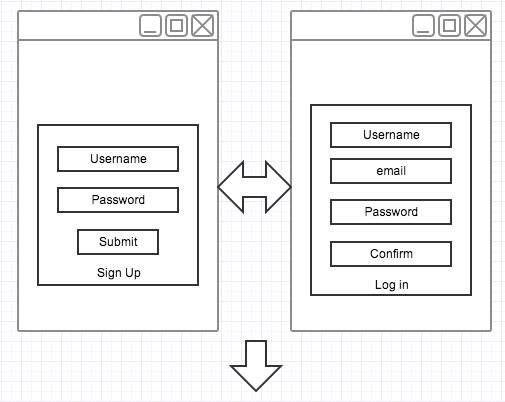
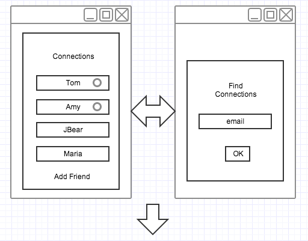
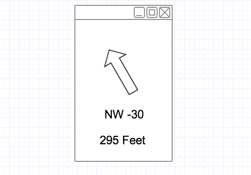

Location App

I. Description

This app will help people connect when they can't find each other. It would be especially be useful in a crowded place. Using HTML5 geolocation and a mobile device, the app will guide people towards each other. User will first sign in on sign in page, then choose the person they are looking, and finally with a bearing and distance, be guided to the other party.

II(a). User Stories

(MVP) As a user on the homepage, I must sign in with username and password to find another person, so the app knows what I am looking for.

As an authorized user, I will be shown a list of people that I have previously added to my friends list, so I can choose whom to search for.

As an authorized user, I will be able to see who is logged in and searchable & a who is a connection, but unavailable, so I know if I can find that person.

As an authorized user given my list of connections, I will have an option to add another person to my list, so I can search for them.

As a user that has chosen a connection, I will be given a page with a direction and distance to the other person, so I know how to find my friend.

Indicators (beyond MVP) As a user being guided to a connection, I will be given an arrow or compass that continually upates me to my destination.

As a user being guided to a connection, I will be guided by the background color continually updating. Starting on a scale of cold or blue and moving finally to red, as a further indication that I am on the correct or incorrect route to finding my friend.

(Extra Credit) Have a way to chat with your friend as you are being guided.

III. Phases & due dates

V0 - Thursday - Create Rails app with models allowing me to Login, List of Friends, and Friends currently logged in.

V1 - Saturday - Location of self and final destination, with a bearing (possibly fixed at first depending on the complexity of the problem) and distance to the destination.

V2 - Sunday - Moving arrow or compass and changing background as indicators to guide to destination

V3 - Tuesday or Wednesday - Chat to friend..

IV. Phase I - details

As an user not logged in, I will be given a screen to enter username and password, so I can log in.

As a user not logged in, I will also be given an option to sign up for access, so I can log in.

As a user not logged in without an account, I will be able to enter several fields to get an account, so I can log in.

As a user logged in, I can view a list of friends, so I can find a choose someone to find.

As a user logged in, I can see who is currently logged in and who is not, so I know who I can currently find.

As a user logged in, I have an option to find a new connection and can add them by entering an email, so I can find them.

##### V. Data model

##### II(b). Wireframe

Thoughts:

Will need to check if users are logged in by checking friends sessions.